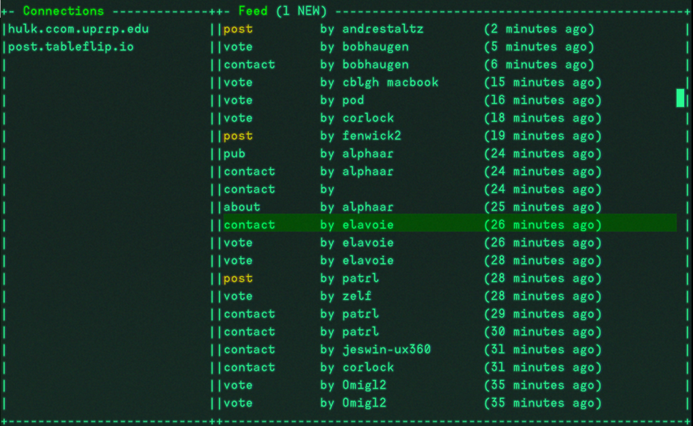

# feedpunk

A [scuttlebutt](https://www.scuttlebutt.nz) client in the terminal.



features (so far):

* unsorted, unfiltered infinite scrolling list of all your SSB data
* view a message
* connects to peers

# install

`npm i -g @staltz/feedpunk`

# usage

Open it in the terminal:

```
feedpunk
```

Keyboard commands:

* `j` or down arrow: scroll down
* `k` or up arrow: scroll up
* `g`: scroll all the way up
* `G`: scroll all the way down
* `space`: open a message
* `q`: exit

# contributing

just fork it. I don't have issues enabled on this repo because I'm just [gifting this repo, not committing to maintain it for you](https://staltz.com/open-source-without-maintainers.html). enjoy the gift!
